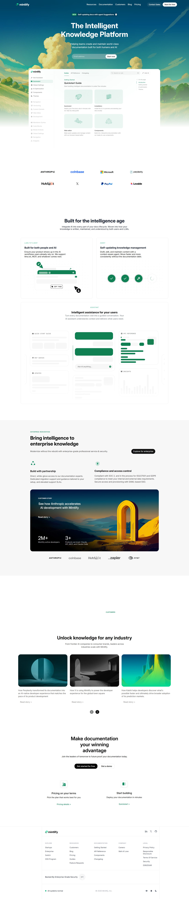

# Recreate - Mintlify

<small>[Date : 07-02-26]</small>


The goal of this assignment was to focus on **visual and structural similarity**. I can tried to match the original Cursor website as closely as possible using only **HTML and CSS**.

---

### Project Objective

- Recreate a developer tool landing page inspired by Cursor
- Focus on structure, layout, and visual hierarchy
- Practice semantic HTML and CSS layout skills
- Work without JavaScript, Animation, Frameworks, Intractivity

---

### Sections Recreated

Reference design structure:

1. Top Navigation Bar  
2. Hero Section  
3. Trusted By / Brand Logos  
4. Feature Sections  
5. Testimonials Section  
6. Frontier Section  
7. Changelog Section  
8. Team Section  
9. Highlights Section  
10. CTA Section  
11. Footer with multi-column links 

---

#### Fonts & Colors

```
- System fonts -->  `Arial, Helvetica, sans-serif`
```

```
- Background: `#14120b`, `#1b1912`
- Text: `#ffffff`, `#999894`
- Accent: `#ff6b35`
- Buttons: #ffffff 
```

---

### Screenshot -
Below screenshots shows output of project (possible to recreated similar <i>but not exact match from my side</i>)



---

### Work Coverage

✔ Structural similarity to original  
✔ Layout and spacing effort  
✔ Font and color palette matching  
✔ Clean and semantic HTML usage  
✔ Overall visual closeness to reference  

> Note: This is not a 100% pixel-perfect clone but a `close structural recreation`.

---

### Self Evaluation

> What I Did Well

- Used `semantic HTML` (header, nav, section, footer)
- Recreated most major sections from Cursor
- Maintained theme and similar color palette
- Practiced layout using `flexbox` and `grid`
- Organized sections clearly
- Followed assignment constraints

---

> What not perfect from my side

- Design is not pixel-perfect
- Some spacing and alignment differ from original
- Some images differ from original
- Some positions used absolute values for alignment

---

### Pending Improvements

If I improve this project in future:

- Improve pixel-perfect spacing
- Use exact Cursor fonts
- Better alignment for testimonial cards
- Improve changelog positioning (less absolute positioning)
- Add responsiveness (mobile/tablet)
- Optimize CSS structure and reuse classes
- Improve accessibility (better alt text)

---

### Learning outcome

This project helped me learn:

- How real web landing pages are structured
- How to `recreate layouts from references?`
- Better CSS layout control (`flex & grid)`
- Importance of spacing and visual hierarchy
- Semantic HTML structure

---

`Thank You..`